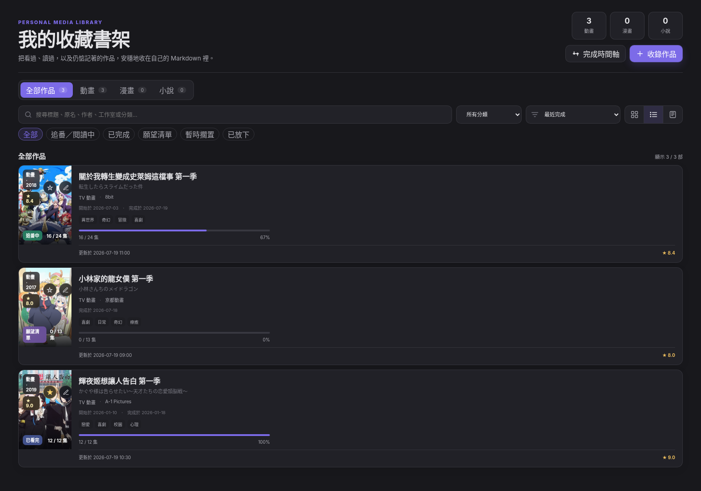
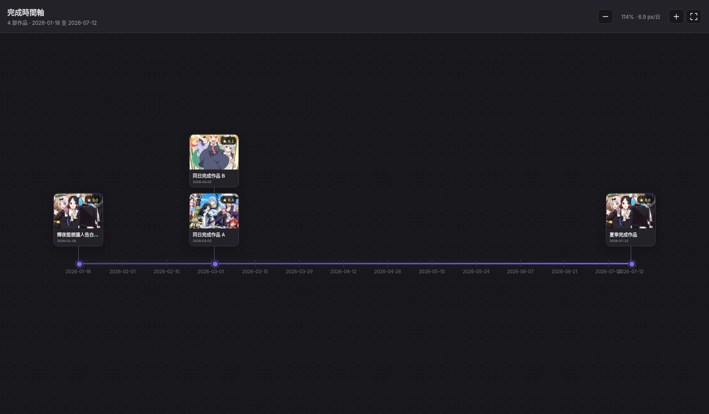

# AnimeList

AnimeList is an Obsidian plugin for tracking anime, manga, and novels in ordinary Markdown files. It provides a native library view, external metadata search, local cover downloads, ratings, progress, templates, filters, favorites, and a completion timeline.

The Markdown files remain the source of truth. Removing the plugin does not remove your media records, notes, or images.





## Features

- Native Obsidian custom view opened from the ribbon or command palette.
- Anime, manga, and novel records in one library.
- Search metadata from Bangumi, AniList, and Open Library.
- Download cover images into the vault, with remote-image fallback.
- Card, list, and compact views.
- Filter by media type, status, and normalized genre.
- Sort by completion date, file modification time, score, start date, year, progress, or title.
- Required title, personal score, and completion date for newly created or edited records.
- Automatic completed-progress synchronization.
- One-click favorite toggle from the library.
- Built-in and user-defined Markdown templates.
- A pannable completion timeline where zoom changes the spacing between days rather than the poster size.
- Desktop and mobile support.
- No Dataview dependency and no private media database.

## Installation

### Community plugins

After AnimeList is accepted into the Obsidian community plugin directory:

1. Open **Settings → Community plugins**.
2. Select **Browse**.
3. Search for **AnimeList**.
4. Install and enable the plugin.

### Manual installation

1. Download `main.js`, `manifest.json`, and `styles.css` from a GitHub release.
2. Create this folder inside your vault:

   ```text
   <vault>/.obsidian/plugins/animelist/
   ```

3. Copy the three release files into that folder.
4. Reload Obsidian.
5. Enable **AnimeList** under **Settings → Community plugins**.

### BRAT testing before community publication

After this repository is public and has a release, it can also be installed through BRAT by adding the GitHub repository URL. BRAT is useful for pre-release testing but is not required by AnimeList.

## First use

1. Enable AnimeList.
2. Select the library icon in the left ribbon, or run **AnimeList: Open library** from the command palette.
3. Select **收錄作品** to search for an anime, manga, or novel.
4. Choose a search result, enter your score and dates, select a template, and create the note.

The interface uses Traditional Chinese. Text returned directly by metadata providers may remain in the provider's original language.

## Storage layouts

AnimeList supports two storage layouts.

### Managed library — default

The default library root is `AnimeList`:

```text
AnimeList/
├── Anime/
├── Manga/
├── Novel/
├── Covers/
│   ├── anime/
│   ├── manga/
│   └── novel/
└── Templates/
    ├── Anime/
    ├── Manga/
    ├── Novel/
    └── Common/
```

New notes are placed in a media-type subfolder.

### Flat folder

Flat mode writes every media note directly into one selected folder:

```text
My media/
├── Work A.md
├── Work B.md
└── Work C.md
```

AnimeList does not create Anime, Manga, or Novel subfolders in this mode. The cover and template folders remain separately configurable.

Change the layout under **Settings → AnimeList → Storage layout**.

## Reading existing Markdown data

AnimeList does not require a migration process. It scans configured folders and reads any Markdown file containing a supported `media_type` property.

There are three ways to make existing files visible:

1. Set **Library root** to the parent folder of an existing managed library.
2. Select **Flat folder** mode and point it at a folder containing media notes.
3. Add one or more paths under **Additional scan folders**. This reads the files in place without moving them.

For example, to read data from the earlier prototype vault, add:

```text
Media
```

under **Additional scan folders**.

### Required properties

AnimeList requires these properties when it creates or edits a record:

```yaml
---
title: 輝夜姬想讓人告白 第一季
media_type: anime
score: 9
completed_at: 2026-01-18
---
```

For imported existing notes, `media_type` is the minimum property needed for discovery. Missing fields can then be completed through the edit dialog.

Supported `media_type` values:

```text
anime
manga
novel
```

### Full example

```yaml
---
schema_version: 4
title: 輝夜姬想讓人告白 第一季
title_original: かぐや様は告らせたい～天才たちの恋愛頭脳戦～
media_type: anime
format: tv
status: completed
progress: 12
progress_total: 12
progress_unit: episode
score: 9
favorite: true
started_at: 2026-01-10
completed_at: 2026-01-18
year: 2019
genres:
  - 戀愛
  - 喜劇
studios:
  - A-1 Pictures
cover: AnimeList/Covers/anime/kaguya-sama.webp
source_provider: anilist
source_id: "101921"
source_urls:
  - https://anilist.co/anime/101921
---
```

AnimeList uses the file's real modification time for the **recently updated** sort. It does not create or maintain an `updated_at` property.

## Status and progress rules

The current interface uses these status labels:

- `watching` or `reading`: 追番中
- `completed`: 已完成
- `planned`: 待追
- `on_hold`: 棄番

Legacy `dropped` values are displayed as 棄番.

When a record is marked completed:

- `progress` is automatically set to `progress_total`.
- Changing the total keeps the completed progress synchronized.
- The completion date defaults to the current date when it is missing.

## Templates

AnimeList always provides built-in templates. It can also read custom Markdown templates from the configured template folder.

Expected subfolders:

```text
AnimeList/Templates/
├── Anime/
├── Manga/
├── Novel/
└── Common/
```

Templates in `Common` are available to every media type. Files directly inside the template root are also treated as shared templates.

Supported variables:

```text
{{title}}
{{date}}
{{time}}
{{original_title}}
{{media_type}}
{{cover}}
{{summary}}
{{source_url}}
```

Use **Settings → AnimeList → Copy default templates** to write the built-in Traditional Chinese templates into the vault. Existing files are never overwritten.

## Metadata providers and privacy

AnimeList can query:

- Bangumi for anime, manga, and light novels.
- AniList for anime, manga, and light novels.
- Open Library for general novels and books.

Providers can be disabled individually in settings.

Search terms are sent only to the enabled metadata providers. Personal scores, progress, dates, favorites, and note bodies are not uploaded by AnimeList.

## Development

### Requirements

- Node.js 18 or newer.
- npm.
- Obsidian Desktop for the local test vault.

### Install dependencies

```bash
npm ci
```

A clean first install should normally finish within tens of seconds. If it runs for more than two minutes, stop it and run:

```bash
npm ci --foreground-scripts --timing --loglevel verbose
```

The repository intentionally does not force a registry URL; npm uses the registry or mirror configured on the developer machine.

The runtime `obsidian` module is still provided by Obsidian itself. For compilation, this repository uses a small local declaration file at `types/obsidian.d.ts` instead of downloading the full Obsidian, CodeMirror, and Moment development dependency chain. This keeps a clean install to four packages on the current platform.

### Run automated checks

```bash
npm run typecheck
npm test
npm run build
```

Or run all checks:

```bash
npm run check
```

### Test in the included vault

The repository includes `test-vault` with three example anime records and local cover images. Normal plugin installation does not add these examples.

Run:

```bash
npm run test-vault:link
npm run dev
```

Then:

1. Open `test-vault` as an Obsidian vault.
2. Allow community plugins.
3. Enable **AnimeList**.
4. Select the library ribbon icon.
5. Test card, list, and compact views; editing; favorites; filters; metadata search; storage settings; and the completion timeline.
6. After source changes, reload Obsidian or disable and re-enable AnimeList.

`npm run test-vault:link` creates this development link:

```text
test-vault/.obsidian/plugins/animelist -> repository root
```

Set `ANIMELIST_TEST_VAULT` to link a different local vault:

```bash
ANIMELIST_TEST_VAULT=/path/to/vault npm run test-vault:link
```

### Test a production build manually

```bash
npm run build
mkdir -p "/path/to/vault/.obsidian/plugins/animelist"
cp main.js manifest.json styles.css "/path/to/vault/.obsidian/plugins/animelist/"
```

Reload Obsidian and enable the plugin.

### Mobile testing

The plugin is not desktop-only. Before a community submission, test at least:

- The library view on a narrow screen.
- Add and edit dialogs.
- Scrolling and compact mode.
- Timeline panning and toolbar controls.
- Local cover loading.

The desktop test vault can be used for initial responsive checks, but an actual iOS or Android vault should be tested before release.

## Releasing on GitHub

Obsidian releases require `manifest.json`, `main.js`, and `styles.css` as release assets. The release tag must exactly match the plugin version and must not include a `v` prefix.

### Prepare a release

1. Update `CHANGELOG.md`.
2. Update the version with npm, for example:

   ```bash
   npm version patch
   ```

   The version hook updates `manifest.json` and `versions.json`.

3. Run:

   ```bash
   npm ci
   npm run check
   npm run release:check
   ```

4. Push the commit and exact version tag:

   ```bash
   git push origin main
   git push origin 1.0.0
   ```

The `Release Obsidian plugin` GitHub Action builds the plugin and creates a GitHub release containing:

```text
manifest.json
main.js
styles.css
```

## Submitting to Obsidian Community Plugins

Before submitting the first version:

1. Make the GitHub repository public.
2. Replace the placeholder `author` in `manifest.json` with the public author or organization name you want shown in Obsidian.
3. Confirm that the plugin ID `animelist` is available and keep it unchanged after publication.
4. Publish a GitHub release whose tag exactly matches `manifest.json`.
5. Confirm that the release contains `manifest.json`, `main.js`, and `styles.css`.
6. Keep `manifest.json` and `README.md` in the repository root.
7. Run the full desktop and mobile manual test checklist.
8. Sign in to the Obsidian Community site and open the Developer Dashboard.
9. Connect the GitHub account that owns the public `AnimeList` repository.
10. Choose the repository, complete the required disclosures, and run the preview scan.
11. Submit the plugin after the preview scan passes.

The Developer Dashboard runs automated security and code-quality checks. The repository must remain public, and the installable release must contain `manifest.json`, `main.js`, and `styles.css`. Obsidian reads the repository `README.md` and `manifest.json`, while installable files are downloaded from the matching GitHub release.

## Repository structure

```text
AnimeList/
├── .github/workflows/
│   ├── ci.yml
│   └── release.yml
├── docs/images/
├── scripts/
├── src/
│   ├── builtin-templates.ts
│   ├── legacy.ts
│   ├── main.ts
│   ├── settings.ts
│   └── types.ts
├── tests/
├── test-vault/
├── CHANGELOG.md
├── CONTRIBUTING.md
├── LICENSE
├── README.md
├── SECURITY.md
├── esbuild.config.mjs
├── manifest.json
├── package.json
├── styles.css
├── tsconfig.json
└── versions.json
```

## License

MIT
