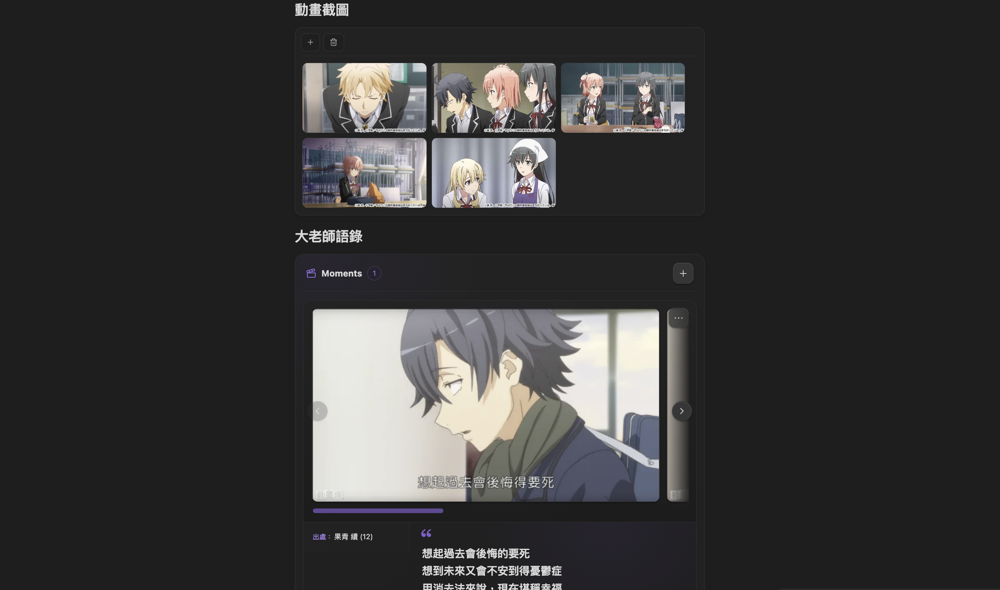

# AnimeList

AnimeList is a local-first Obsidian plugin for tracking anime, manga, and novels in ordinary Markdown files. It provides a native library, metadata search, local covers, progress tracking, ratings, templates, release tracking, reusable note media sections, a Score Dashboard, and a completion timeline.

Your Markdown notes remain the source of truth. Removing the plugin does not remove your records, notes, or images.

> [!CAUTION]
> **Existing libraries and update cleanup**
>
> Existing 1.3.1 libraries remain readable without an automatic startup migration. Older notes may still be missing classification metadata introduced in 1.3, and older generated note bodies may contain a redundant standalone cover below `animelist-detail`. Back up or sync the vault before using **Settings → Updates & cleanup**. The available cleanup tools are explicit, review-first operations and preserve unrelated frontmatter and Markdown body content.

<table>
  <tr>
    <td width="50%" align="center">
      <br>
      <sub><b>Library</b></sub>
    </td>
    <td width="50%" align="center">
      <br>
      <sub><b>Score Dashboard</b></sub>
    </td>
  </tr>
  <tr>
    <td width="50%" align="center">
      <br>
      <sub><b>Note media</b></sub>
    </td>
    <td width="50%" align="center">
      <br>
      <sub><b>Timeline</b></sub>
    </td>
  </tr>
</table>

> [!NOTE]
> **What's new**
>
> - Added interface localization for Traditional Chinese, English, Japanese, and Korean, with an option to follow Obsidian's interface language. Settings remain English.
> - Added opt-in release tracking for manga chapters and already-published novel volumes. Manga can combine MangaDex with supported official public chapter sources discovered from preserved AniList identity; novels use NDL/JPRO publication data. Tracking never overwrites reading progress.
> - Added reusable **Image Sections** inside media notes with file, drag-and-drop, clipboard, and URL import; lightbox navigation; copy; Set as cover; multi-select deletion; duplicate protection; and local thumbnail caching.
> - Added reusable **Moments** for saving a quote or scene as text plus one or more images, with optional source, position, speaker, tags, and notes.
> - Reorganized Settings into General, Search & metadata, Features, Maintenance, and Updates & cleanup pages with clearer same-page groups.
> - Added review-first cleanup for redundant generated note covers and kept legacy metadata cleanup explicit rather than rewriting libraries on startup.
> - Removed CSS multi-column and non-baseline scrollbar properties from note media layouts so Community compatibility checks do not rely on browser features only partially supported by older Obsidian releases.

## Features

- One Markdown-based library for anime, manga, and novels.
- Metadata search through Bangumi, AniList, and Open Library, with structured classification metadata for supported works.
- Card, list, and poster views with search, sorting, and combined company, quarter, and tag filters.
- Media-specific progress tracking and dated serial entries with optional per-entry covers.
- Optional manga/novel latest-release tracking that is separate from personal reading progress.
- Reusable Image Sections and Moments stored directly in ordinary Markdown notes.
- A Score Dashboard for direct and batch rating changes.
- Favorite mode or reusable Masterpiece categories.
- A pannable and zoomable completion timeline.
- Local series, serial-entry, Image Section, and Moment images with safe reference-aware cleanup.
- Traditional Chinese, English, Japanese, and Korean interface support.
- Desktop and mobile support without a Dataview dependency.

## Installation

### Community plugins

1. Open **Settings → Community plugins** in Obsidian.
2. Select **Browse** and search for **AnimeList**.
3. Install and enable the plugin.

### Manual installation

1. Download `main.js`, `manifest.json`, and `styles.css` from the matching GitHub release.
2. Copy them into `<vault>/.obsidian/plugins/animelist/`.
3. Reload Obsidian and enable **AnimeList** under **Community plugins**.

## Quick start

1. Open AnimeList from the ribbon or run **AnimeList: Open library** from the command palette.
2. Select **收錄**, choose anime, manga, or novel, and search for a title.
3. Review the imported metadata and save the note.
4. Update its status, progress, dates, rating, or special label from the library.
5. For manga or novels, enable **Latest release tracking** under Settings → Features if you want source-backed latest chapter/volume information.
6. Inside a media note, use the editor context menu **AnimeList** submenu to insert an Image Section or Moments section where you want it.

AnimeList can display its main interface in Traditional Chinese, English, Japanese, or Korean. The Settings page itself stays in English. Choose a language there or follow Obsidian's interface language. Recognized provider-supplied tag/category labels are displayed in the selected interface language, while media titles, raw provider metadata, custom reusable tags, Markdown/frontmatter, and existing templates are not rewritten.

## Documentation

See the [User Guide](docs/USER_GUIDE.md) for status rules, progress units, serial-entry covers, metadata and filters, reusable tags, release tracking, Image Sections, Moments, cleanup tools, Masterpiece categories, the Score Dashboard, the timeline, Markdown data, and templates.

## Metadata, network access, and privacy

- Search and enrichment queries are sent only to enabled metadata providers.
- Release tracking, when enabled, contacts its configured public metadata/catalog sources and supported official public chapter pages; it does not send personal ratings, progress, dates, or note-body text.
- Personal ratings, progress, dates, labels, Moments text, and note content stay in the vault.
- Covers and note-media images are stored locally when available, with remote-image fallback only where the relevant feature supports it.
- AnimeList does not include telemetry or a private remote library database.

## Development

Requirements: Node.js 18 or newer and npm.

```bash
npm ci
npm run check
```

For a production bundle:

```bash
npm run build
```

See [CONTRIBUTING.md](CONTRIBUTING.md), the [manual test checklist](docs/MANUAL_TEST_CHECKLIST.md), [CHANGELOG.md](CHANGELOG.md), and [ROADMAP.md](ROADMAP.md) for project details.

## License

[MIT](LICENSE)
