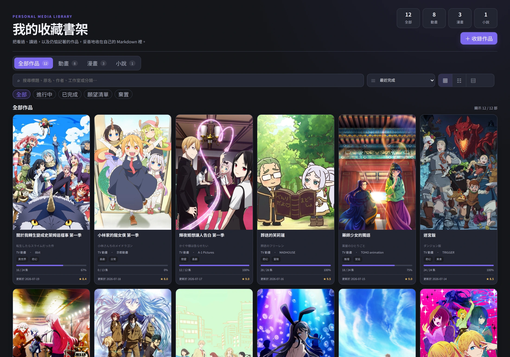
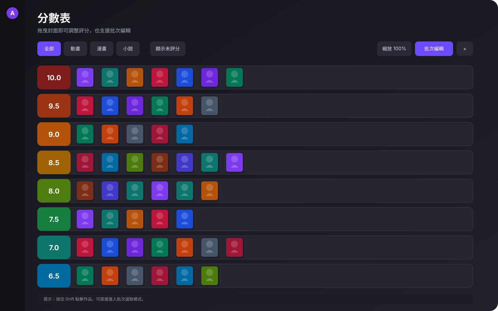
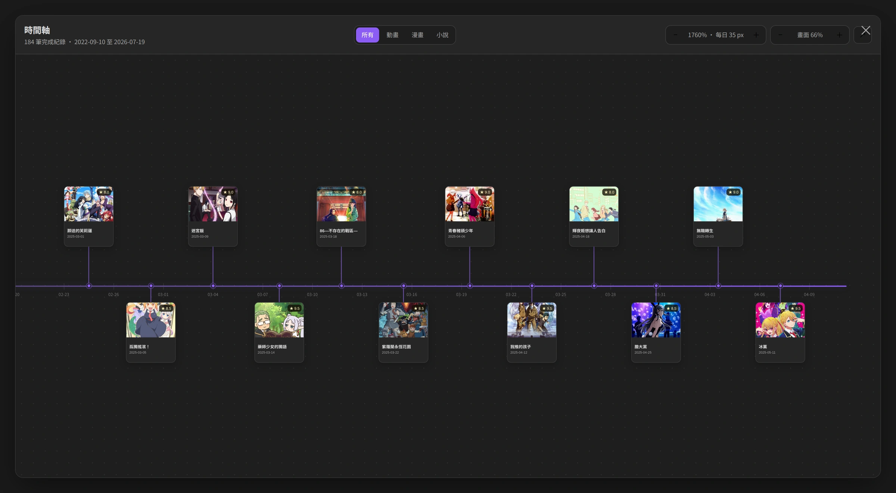

# AnimeList

AnimeList is a local-first Obsidian plugin for tracking anime, manga, and novels in ordinary Markdown files. It provides a native library, metadata search, local covers, progress tracking, ratings, templates, a Score Dashboard, and a completion timeline.

Your Markdown notes remain the source of truth. Removing the plugin does not remove your records, notes, or images.

<table>
  <tr>
    <td colspan="2" align="center">
      <br>
      <sub><b>Library</b></sub>
    </td>
  </tr>
  <tr>
    <td width="50%" align="center">
      <br>
      <sub><b>Score Dashboard</b></sub>
    </td>
    <td width="50%" align="center">
      <br>
      <sub><b>Timeline</b></sub>
    </td>
  </tr>
</table>

> [!NOTE]
> **What's new in 1.2.0**
>
> - Added a Score Dashboard for organizing titles across all 0–10 ratings, with drag-and-drop and batch editing.
> - Added an optional Masterpiece mode with reusable categories and support for assigning a title to multiple categories.
> - Added chapter, season, and volume tracking for manga and novels, including dated progress entries.
> - Standardized ratings to 0.5-point increments and simplified library statuses to Ongoing, Completed, Wishlist, and Dropped.
> - Improved multilingual search, result ranking, provider coverage, and conservative duplicate-title warnings.
> - Improved timeline scaling, progress presentation, and interface terminology.

## Features

- One Markdown-based library for anime, manga, and novels.
- Metadata search through Bangumi, AniList, and Open Library.
- Card, list, and poster views with search, filters, and sorting.
- Media-specific progress tracking and dated serial entries.
- A Score Dashboard for direct and batch rating changes.
- Favorite mode or reusable Masterpiece categories.
- A pannable and zoomable completion timeline.
- Local covers and built-in or custom Markdown templates.
- Desktop and mobile support without a Dataview dependency.

## Installation

### Community plugins

1. Open **Settings → Community plugins** in Obsidian.
2. Select **Browse** and search for **AnimeList**.
3. Install and enable the plugin.

### Manual installation

1. Download `main.js`, `manifest.json`, and `styles.css` from the matching GitHub release.
2. Copy them into `<vault>/.obsidian/plugins/animelist/`.
3. Reload Obsidian and enable **AnimeList** under **Community plugins**.

## Quick start

1. Open AnimeList from the ribbon or run **AnimeList: Open library** from the command palette.
2. Select **收錄**, choose anime, manga, or novel, and search for a title.
3. Review the imported metadata and save the note.
4. Update its status, progress, dates, rating, or special label from the library.

The interface uses Traditional Chinese. Provider metadata may remain in its original language.

## Documentation

See the [User Guide](docs/USER_GUIDE.md) for status rules, progress units, search, Masterpiece categories, the Score Dashboard, the timeline, Markdown data, and templates.

## Metadata and privacy

- Search terms are sent only to enabled metadata providers.
- Personal ratings, progress, dates, labels, and note content stay in the vault.
- Covers are stored locally when available, with remote-image fallback.

## Development

Requirements: Node.js 18 or newer and npm.

```bash
npm ci
npm run check
```

For a production bundle:

```bash
npm run build
```

See [CONTRIBUTING.md](CONTRIBUTING.md), the [manual test checklist](docs/MANUAL_TEST_CHECKLIST.md), [CHANGELOG.md](CHANGELOG.md), and [ROADMAP.md](ROADMAP.md) for project details.

## License

[MIT](LICENSE)
